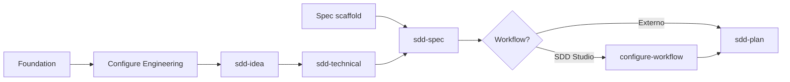

# Flujo Greenfield — SDD Studio

Fuente de verdad del camino feliz para proyectos **greenfield** (sin código existente).

## Convenciones

| Concepto | Valor |
| -------- | ----- |
| CLI | `npx sdd-studio` o `sdd-studio` |
| Init | `sdd-studio init` |
| Configure Engineering | `sdd-studio configure` o menú TUI **Configure Engineering** |
| Configure Workflow | `sdd-studio configure-workflow` (planificado) |
| Skills | Invocar en el asistente elegido (`/sdd-idea`, skill **sdd-idea**, etc.) |

### Orden canónico de skills

```text
configure → sdd-idea → sdd-technical → sdd-spec → [workflow] → sdd-plan
```

**Camino flexible:** puedes empezar por **sdd-idea**. Cuando el producto esté claro, ejecuta **configure** y luego **sdd-technical**.

### Mapa `.workspace/`

| Carpeta | Pregunta |
| ------- | -------- |
| `brief/business/` | ¿Qué producto queremos? |
| `brief/technical/` | ¿Cómo decidimos construirlo? |
| `spec/business/` + `spec/technical/` | ¿Cómo está especificado? |
| `workflow/` | ¿Cómo organizamos el trabajo? (después de spec) |

---

## 1. Arranque de la terminal

Al ejecutar `sdd-studio`, la TUI pregunta:

- **Greenfield** — flujo de este documento
- **Brownfield** — próximamente

### Menú principal (Greenfield)

| Opción | Qué hace |
| ------ | -------- |
| **Create Business & Technical foundation** | Brief stubs + skills del asistente. Sin `spec/`, sin `workflow/` |
| **Create spec scaffold** | Carpetas vacías `spec/business/` y `spec/technical/` |
| **Configure Engineering** | TUI del Engineering Brief |
| **Configure Workflow** | Metodología y convenciones de tareas (planificado; tras spec) |
| **Sync Assistant Files** | Actualiza skills del paquete |
| **Exit** | Cierra la TUI |

---

## 2. Foundation — Create Business & Technical foundation

Equivalente a `sdd-studio init` (sin spec ni workflow).

**Genera:**

- `.workspace/brief/business/` — stubs `product-principles.md`, `product-guide.md`
- `.workspace/brief/technical/` — stubs de engineering (sin stack)
- Skills del asistente (`.cursor/skills/`, etc.)

**No genera:** `spec/`, `workflow/`, `engineering-stack.md`, código de aplicación.

**Next step:** **Configure Engineering** o **sdd-idea** (si prefieres empezar por producto).

---

## 3. Configure Engineering

TUI o `sdd-studio configure`.

**Archivos generados (6):**

- `engineering-principles.md`
- `engineering-decisions.md`
- `engineering-conventions.md`
- `engineering-frontend-patterns.md`
- `engineering-backend-patterns.md`
- `engineering-contribution-patterns.md`

Flujo: preguntas por sección → resumen → confirmación.

**Next step:** **sdd-idea**

---

## 4. Definición de la idea — sdd-idea

El usuario describe la idea en el chat y ejecuta **sdd-idea**.

**Fases:** descubrimiento → preguntas → confirmación funcional.

**Genera:**

- `product-principles.md`
- `product-guide.md`

**Si empezaste por idea sin configure:** al terminar, mensaje amigable → `sdd-studio configure` → **sdd-technical**.

**Next step:** **sdd-technical** (con Engineering Brief completo).

---

## 5. Spec scaffold — Create spec scaffold

En TUI, antes de **sdd-spec**.

**Genera:** carpetas vacías bajo `.workspace/spec/business/` y `.workspace/spec/technical/`.

---

## 6. Diseño técnico — sdd-technical

Lee el Engineering Brief (6 archivos de configure + patterns).

Preguntas por superficie (web, mobile, backend, DB, auth, …) → confirmación → escribe:

- `engineering-stack.md`

**Next step:** **sdd-spec**

---

## 7. Especificación — sdd-spec

Lee brief completo (producto + engineering + stack).

Genera módulos bajo `spec/business/` y `spec/technical/` (domain, relations, capabilities, flows, rules, security, events, api, ui, testing, architecture, database).

**Next step:** selección de proveedor de trabajo.

---

## 8. Workflow — post-spec

La skill o el asistente pregunta con qué workflow trabajar:

| Elección | Acción |
| -------- | ------ |
| **SDD Studio** | `sdd-studio configure-workflow` → metodología (Kanban, Scrum, …) + convenciones → `.workspace/workflow/` |
| **Linear / GitHub Issues / otro** | No instalar workflow SDD; **sdd-plan** sigue disponible |

**Next step:** **sdd-plan**

---

## 9. Planificación — sdd-plan

Lee brief + spec + patrones de tareas del brief técnico (+ workflow config si aplica).

Propuesta → confirmación → genera:

- `workflow/roadmap/`
- `workflow/milestones/`
- `workflow/releases/release-NNN/` (`release.md`, `tasks.md`, `reviews.md`, `decisions.md`)

**Next step:** implementar la primera tarea con el agente de desarrollo.

---

## 10. Ciclo iterativo (referencia)

| Skill | Cuándo |
| ----- | ------ |
| **sdd-review** | Opcional; validar cambios contra Brief o spec |
| **sdd-generate** | Brownfield — fuera de este flujo |

---

## Diagrama



---

## Fuera de alcance greenfield

- Brownfield (`sdd-generate`, migrate legacy)
- Código de aplicación (`src/`, `tests/`)
- `engineering-modeling.md` — eliminado del flujo; dominio en **sdd-spec**
