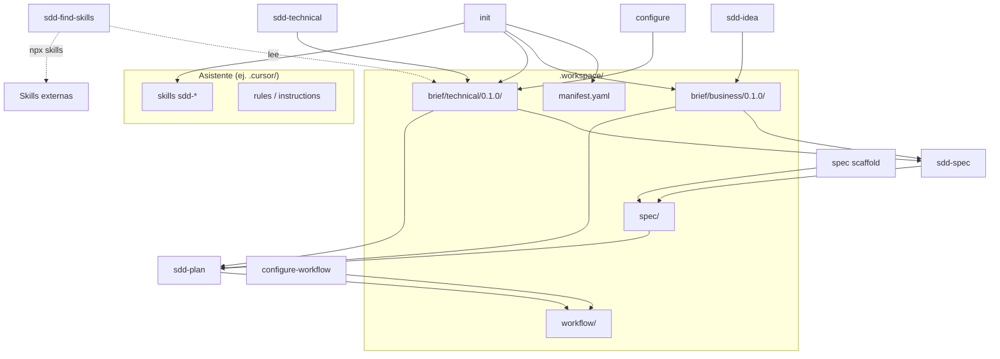

# Arquitectura del workspace SDD Studio

Referencia visual de **todos los archivos y carpetas** que un proyecto puede tener cuando SDD Studio está completamente configurado: greenfield desde `init` hasta spec, workflow y planificación.

Este documento describe la **estructura de conocimiento** del método SDD. No incluye código de aplicación (`src/`, `app/`, etc.) — eso vive fuera de `.workspace/`.

---

## Leyenda

| Símbolo / etiqueta | Significado |
| --- | --- |
| `[foundation]` | `sdd-studio init` o TUI *Create brief scaffold* |
| `[configure]` | `sdd-studio configure` |
| `[sdd-idea]` | Skill **sdd-idea** |
| `[sdd-technical]` | Skill **sdd-technical** |
| `[sdd-find-skills]` | Skill **sdd-find-skills** *(opcional; no escribe en `.workspace/`)* |
| `[spec scaffold]` | TUI *Create spec scaffold* o `init --spec` |
| `[sdd-spec]` | Skill **sdd-spec** |
| `[configure-workflow]` | `sdd-studio configure-workflow` |
| `[sdd-plan]` | Skill **sdd-plan** |
| `[sync]` | `sdd-studio sync` (actualiza skills del paquete) |
| `(stub)` | Plantilla mínima; se reemplaza o completa en un paso posterior |
| `(opcional)` | No obligatorio en todos los proyectos |

---

## Orden canónico (greenfield completo)

```text
init → configure → sdd-idea → sdd-technical → [sdd-find-skills] → spec scaffold → sdd-spec → configure-workflow → sdd-plan
```

Ver [FLOW-GREENFIELD.md](./FLOW-GREENFIELD.md) para el detalle de cada paso.

---

## Vista general

```text
./
├── .workspace/                    # Conocimiento del producto (SDD)
│   ├── brief/                     # Contexto y decisiones
│   ├── spec/                      # Especificación formal por dominios
│   └── workflow/                  # Planificación (releases, tareas)
│
└── <asistente>/                   # Skills e instrucciones (según --assistant)
    ├── Cursor    → .cursor/
    ├── Claude    → CLAUDE.md + .claude/
    ├── Codex     → AGENTS.md + .agents/
    ├── OpenCode  → .opencode/
    └── Copilot   → .github/
```

---

## `.workspace/` — árbol completo

Estado de referencia: **brief `0.1.0`**, un dominio de spec `task`, primera release planificada, asistente **Cursor**.

```text
.workspace/
│
├── brief/
│   │
│   ├── manifest.yaml                          # [foundation] Versiones business/technical + alineación spec
│   │
│   ├── business/
│   │   └── 0.1.0/                             # Carpeta semver activa (business.current)
│   │       ├── product-principles.md          # [foundation] stub → [sdd-idea]
│   │       └── product-guide.md               # [foundation] stub → [sdd-idea]
│   │
│   └── technical/
│       └── 0.1.0/                             # Carpeta semver activa (technical.current)
│           ├── engineering-principles.md      # [foundation] stub → [configure]
│           ├── engineering-decisions.md       # [foundation] stub → [configure]
│           ├── engineering-conventions.md     # [foundation] stub → [configure]
│           ├── engineering-frontend-patterns.md    # [foundation] stub → [configure]
│           ├── engineering-backend-patterns.md     # [foundation] stub → [configure]
│           ├── engineering-contribution-patterns.md # [foundation] stub → [configure]
│           └── engineering-stack.md           # [sdd-technical] (no existe tras foundation)
│
├── spec/                                      # Sin versionado — vive alineada al brief vía manifest
│   │
│   ├── business/
│   │   ├── domain/
│   │   │   ├── .gitkeep                       # [spec scaffold]
│   │   │   └── task-domain.md                 # [sdd-spec]
│   │   ├── relations/
│   │   │   ├── .gitkeep
│   │   │   └── task-relations.md              # [sdd-spec]
│   │   ├── capabilities/
│   │   │   ├── .gitkeep
│   │   │   └── task-capabilities.md           # [sdd-spec]
│   │   ├── flows/
│   │   │   ├── .gitkeep
│   │   │   └── task-flows.md                  # [sdd-spec]
│   │   ├── rules/
│   │   │   ├── .gitkeep
│   │   │   └── task-rules.md                  # [sdd-spec]
│   │   ├── security/
│   │   │   ├── .gitkeep
│   │   │   └── task-security.md               # [sdd-spec]
│   │   ├── events/
│   │   │   ├── .gitkeep
│   │   │   └── task-events.md                 # [sdd-spec]
│   │   └── decisions/
│   │       ├── .gitkeep
│   │       └── task-decisions.md              # [sdd-spec] ADRs del dominio
│   │
│   └── technical/
│       ├── api/
│       │   ├── .gitkeep
│       │   └── task-api.md                    # [sdd-spec]
│       ├── ui/
│       │   ├── .gitkeep
│       │   └── task-ui.md                     # [sdd-spec]
│       ├── testing/
│       │   ├── .gitkeep
│       │   └── task-testing.md                # [sdd-spec]
│       ├── architecture/
│       │   ├── .gitkeep
│       │   └── task-architecture.md           # [sdd-spec]
│       └── database/
│           ├── .gitkeep
│           └── task-database.md               # [sdd-spec]
│
└── workflow/
    ├── workflow-config.md                     # [workflow scaffold] stub → [configure-workflow]
    ├── roadmap/
    │   ├── .gitkeep                           # [workflow scaffold]
    │   └── roadmap-001.md                     # [sdd-plan]
    ├── milestones/
    │   ├── .gitkeep                           # [workflow scaffold]
    │   └── milestone-001.md                   # [sdd-plan]
    └── releases/
        └── release-001/
            ├── release.md                     # [workflow scaffold] stub → [sdd-plan]
            ├── tasks.md                       # [workflow scaffold] stub → [sdd-plan]
            └── reviews.md                     # [workflow scaffold] stub → [sdd-plan]
```

### Varios dominios en `spec/`

Cada dominio nuevo añade **13 archivos** (misma convención `<dominio>-<categoría>.md`). Ejemplo con dominios `task` y `user`:

```text
spec/business/domain/
├── task-domain.md
└── user-domain.md
spec/technical/api/
├── task-api.md
└── user-api.md
# … (11 categorías × N dominios)
```

No se crean subcarpetas por dominio dentro de `spec/`.

---

## `manifest.yaml`

Archivo central de versionado del brief. Las skills resuelven rutas leyendo `business.current` y `technical.current`.

```yaml
schema: 1

business:
  current: "0.1.0"      # brief/business/<current>/
  target: null          # borrador de refactor (brownfield)
  archived: []            # versiones anteriores

technical:
  current: "0.1.0"
  target: null
  archived: []

spec:
  aligned_with:
    business: "0.1.0"     # spec generada contra esta versión del business brief
    technical: "0.1.0"
```

| Campo | Uso |
| --- | --- |
| `current` | Versión activa que leen las skills |
| `target` | Borrador sin romper lo vigente |
| `archived` | Historial |
| `spec.aligned_with` | Trazabilidad spec ↔ brief |

---

## Brief — archivos y responsables

### Business (`brief/business/<semver>/`)

| Archivo | Pregunta que responde | Generado por |
| --- | --- | --- |
| `product-principles.md` | ¿Sobre qué principios conceptuales está construido el producto? | **sdd-idea** |
| `product-guide.md` | ¿Cómo funciona el producto para un usuario? | **sdd-idea** |

### Technical (`brief/technical/<semver>/`)

| Archivo | Pregunta que responde | Generado por |
| --- | --- | --- |
| `engineering-principles.md` | ¿Qué clase de sistema es? (sin stack concreto) | **configure** |
| `engineering-decisions.md` | ¿Cómo se estructura? (repos, DDD, auth, testing…) | **configure** |
| `engineering-conventions.md` | ¿Cómo escribe el equipo? | **configure** |
| `engineering-frontend-patterns.md` | ¿Qué patrones FE aplican a toda feature? | **configure** |
| `engineering-backend-patterns.md` | ¿Qué patrones BE aplican a toda API? | **configure** |
| `engineering-contribution-patterns.md` | ¿Cómo se contribuye (branches, PRs)? | **configure** |
| `engineering-stack.md` | ¿Qué tecnologías concretas usamos? | **sdd-technical** |

**No generado en greenfield:** `engineering-modeling.md` (solo legacy / migrate brownfield).

---

## Spec — 13 archivos por dominio

Convención: `spec/<business|technical>/<categoría>/<dominio>-<categoría>.md`

| # | Ruta (dominio `task`) | Pregunta |
| --- | --- | --- |
| 1 | `business/domain/task-domain.md` | ¿Qué es el dominio? |
| 2 | `business/relations/task-relations.md` | ¿Con qué se relaciona? |
| 3 | `business/capabilities/task-capabilities.md` | ¿Qué puede hacer el sistema? |
| 4 | `business/flows/task-flows.md` | ¿Cómo ocurren los procesos? |
| 5 | `business/rules/task-rules.md` | ¿Qué reglas de negocio aplican? |
| 6 | `business/security/task-security.md` | ¿Quién puede hacer qué? |
| 7 | `business/events/task-events.md` | ¿Qué eventos produce? |
| 8 | `business/decisions/task-decisions.md` | ADRs y decisiones del dominio |
| 9 | `technical/api/task-api.md` | Contrato de API |
| 10 | `technical/ui/task-ui.md` | Comportamiento de interfaz |
| 11 | `technical/testing/task-testing.md` | Escenarios de verificación |
| 12 | `technical/architecture/task-architecture.md` | Módulos y capas |
| 13 | `technical/database/task-database.md` | Persistencia |

Los archivos `*-api.md` y `*-ui.md` deben alinearse con `engineering-*-patterns.md` del brief técnico.

---

## Workflow — planificación

| Ruta | Contenido | Generado por |
| --- | --- | --- |
| `workflow-config.md` | Metodología (Kanban/Scrum) y convenciones de tareas | **configure-workflow** |
| `roadmap/roadmap-NNN.md` | `ROADMAP-NNN`, objetivo, alcance, releases | **sdd-plan** |
| `milestones/milestone-NNN.md` | `MILESTONE-NNN`, criterios (MVP, Beta…) | **sdd-plan** |
| `releases/release-NNN/release.md` | `RELEASE-NNN`, versión, estado, milestone | **sdd-plan** |
| `releases/release-NNN/tasks.md` | Tabla `TASK-NNN` (un archivo por release) | **sdd-plan** |
| `releases/release-NNN/reviews.md` | Tabla `REVIEW-NNN` | **sdd-plan** |

Cada carpeta `release-NNN/` contiene **exactamente** esos tres archivos — sin `decisions.md` ni extras.

---

## Archivos del asistente (Cursor — por defecto)

Instalados con `sdd-studio init --assistant cursor` y actualizables con `sdd-studio sync`.

```text
.cursor/
├── rules/
│   └── sdd-studio.mdc                           # [foundation] Reglas always-on del ciclo SDD
│
└── skills/
    ├── sdd-idea/
    │   ├── SKILL.md
    │   ├── STANDARDS.md
    │   └── EXAMPLES.md
    ├── sdd-technical/
    │   ├── SKILL.md
    │   ├── STANDARDS.md
    │   └── EXAMPLES.md
    ├── sdd-find-skills/                         # (opcional en el flujo)
    │   ├── SKILL.md
    │   ├── STANDARDS.md
    │   └── EXAMPLES.md
    ├── sdd-generate/                            # Brownfield
    │   ├── SKILL.md
    │   ├── STANDARDS.md
    │   └── EXAMPLES.md
    ├── sdd-spec/
    │   ├── SKILL.md
    │   ├── STANDARDS.md
    │   ├── EXAMPLES.md
    │   └── scripts/
    │       └── validate-spec.mjs
    ├── sdd-review/
    │   ├── SKILL.md
    │   ├── STANDARDS.md
    │   ├── EXAMPLES.md
    │   └── scripts/
    │       └── validate-spec.mjs
    └── sdd-plan/
        ├── SKILL.md
        ├── STANDARDS.md
        ├── EXAMPLES.md
        └── scripts/
            └── validate-workflow.mjs
```

### Otros asistentes (misma lógica, distinto layout)

| Asistente | Instrucciones | Skills (7) |
| --- | --- | --- |
| **Claude** | `CLAUDE.md` | `.claude/skills/sdd-*/` |
| **Codex** | `AGENTS.md` | `.agents/skills/sdd-*/` + `agents/openai.yaml` por skill |
| **OpenCode** | — | `.opencode/commands/sdd-*.md` + `.opencode/sdd-studio/sdd-*/` |
| **Copilot** | `.github/copilot-instructions.md` | `.github/agents/*.agent.md` + `.github/prompts/*.prompt.md` + `.github/sdd-studio/sdd-*/` |

Skills empaquetadas: `sdd-idea`, `sdd-technical`, `sdd-find-skills`, `sdd-generate`, `sdd-spec`, `sdd-review`, `sdd-plan`.

---

## Qué genera cada comando CLI

| Comando / acción TUI | Crea en el proyecto |
| --- | --- |
| `sdd-studio init` | `.workspace/brief/` (manifest + stubs `0.1.0`) + skills del asistente |
| `sdd-studio init --spec` | Lo anterior + carpetas `spec/` con `.gitkeep` |
| `sdd-studio init --workflow` | Lo anterior + scaffold `workflow/` |
| `sdd-studio configure` | Completa 6 archivos en `brief/technical/<current>/` |
| `sdd-studio configure-workflow` | Scaffold workflow (si falta) + `workflow-config.md` |
| TUI *Create spec scaffold* | Carpetas `spec/` |
| `sdd-studio sync` | Actualiza skills/reglas del asistente (no toca `.workspace/`) |
| `sdd-studio migrate` | Migra brief legacy a layout versionado (brownfield) |

Las skills conversacionales (**sdd-idea**, **sdd-technical**, **sdd-spec**, **sdd-plan**, etc.) escriben en `.workspace/` según su alcance; no son comandos CLI.

---

## Rutas opcionales y fuera de alcance

| Elemento | Comportamiento |
| --- | --- |
| **sdd-find-skills** | Lee brief técnico; busca en skills.sh; puede instalar skills con `npx skills add`. **No escribe** en `.workspace/`. |
| **sdd-review** | Valida o alinea brief/spec; no crea estructura nueva obligatoria. |
| **sdd-generate** | Brownfield — alinea código existente con brief/spec. |
| **Workflow externo** (Linear, GitHub Issues) | Puede omitirse `workflow/` SDD. |
| **`init` sin `--spec`** | No hay carpeta `spec/` hasta el scaffold. |
| **`init` sin `--workflow`** | No hay `workflow/` hasta configure-workflow o `init --workflow`. |
| **Código de aplicación** | `src/`, `app/`, `packages/`, tests de app — responsabilidad del equipo, no de SDD Studio. |
| **Skills externas instaladas** | Viven en el entorno del asistente (`npx skills`), no bajo `.workspace/`. |
| **Versiones archivadas** | `brief/business/0.0.1/`, `brief/technical/0.2.0/` (target), etc. — según evolución brownfield. |

---

## Resumen de conteos (referencia)

Proyecto greenfield completo con **1 dominio** (`task`) y asistente **Cursor**:

| Grupo | Archivos aprox. |
| --- | --- |
| Brief | 1 manifest + 2 business + 7 technical = **10** |
| Spec (scaffold) | **13** `.gitkeep` |
| Spec (dominio `task`) | **13** `.md` |
| Workflow | 1 config + 2 roadmap/milestone + 3 release = **6** (+ 2 `.gitkeep`) |
| Cursor (skills + rule) | **~26** archivos |

Cada dominio adicional en spec: **+13** archivos. Cada release adicional: **+3** archivos en `releases/release-NNN/`.

---

## Diagrama de dependencias



---

## Documentación relacionada

| Documento | Contenido |
| --- | --- |
| [FLOW-GREENFIELD.md](./FLOW-GREENFIELD.md) | Flujo paso a paso greenfield |
| [FLOW-BROWNFIELD.md](./FLOW-BROWNFIELD.md) | Proyectos con código existente |
| [SKILLS.md](./SKILLS.md) | Catálogo y alcance de cada skill |
| [PRESENTACION.md](./PRESENTACION.md) | Guía para presentar la solución |
| [README.md](../README.md) | Instalación y referencia CLI |
