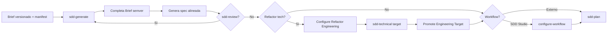

# Flujo Brownfield — SDD Studio

Fuente de verdad del camino feliz para proyectos **brownfield** (código existente).

## Convenciones

| Concepto | Valor |
| -------- | ----- |
| CLI | `npx sdd-studio` o `sdd-studio` |
| Menú brownfield | TUI **Brownfield** al arrancar `sdd-studio` |
| Migrate legacy | `sdd-studio migrate` o TUI **Migrate** |
| Skills | Invocar en el asistente elegido (`/sdd-generate`, skill **sdd-generate**, etc.) |

### Orden canónico de skills

```text
migrate (si legacy) → sdd-generate → [sdd-review] → sdd-plan
```

Para cambios de stack o arquitectura:

```text
Configure Refactor Engineering → sdd-technical (target) → Promote Engineering Target
```

### Versionado del Brief

El brief brownfield usa **carpetas semver** y un manifiesto central:

| Archivo / carpeta | Rol |
| ----------------- | --- |
| `.workspace/brief/manifest.yaml` | Punteros `current`, `target` y `archived` por carril |
| `.workspace/brief/business/<semver>/` | Business Brief versionado (`0.1.0`, `0.2.0`, …) |
| `.workspace/brief/technical/<semver>/` | Technical Brief versionado |
| `.workspace/spec/` | Spec viva, alineada con versiones declaradas en el manifiesto |

**Contrato `manifest.yaml` (schema: 1):**

```yaml
schema: 1

business:
  current: "0.1.0"
  target: null
  archived: []

technical:
  current: "0.1.0"
  target: "0.2.0"  # o null si no hay borrador en curso
  archived: []

spec:
  aligned_with:
    business: "0.1.0"
    technical: "0.1.0"
```

- **Semver completo** en nombres de carpeta: `0.1.0`, no `0.1`.
- **`current`**: versión activa del carril.
- **`target`**: borrador de la siguiente versión (`null` si no hay trabajo en curso).
- **`archived`**: versiones anteriores conservadas.
- **`spec.aligned_with`**: versiones del brief con las que la spec está alineada.

Layouts **planos** legacy (`brief/business/product-guide.md` sin semver) se detectan cuando falta `manifest.yaml`; deben migrarse con **Migrate** antes de usar resolución de rutas versionadas.

### Mapa `.workspace/`

| Carpeta | Pregunta |
| ------- | -------- |
| `brief/manifest.yaml` | ¿Qué versión de cada carril está activa o en borrador? |
| `brief/business/<semver>/` | ¿Qué producto describe esta versión? |
| `brief/technical/<semver>/` | ¿Cómo decidimos construirlo en esta versión? |
| `spec/business/` + `spec/technical/` | ¿Cómo está especificado (alineado al manifiesto)? |
| `workflow/` | ¿Cómo organizamos el trabajo? (opcional, post-spec) |

---

## 1. Arranque de la terminal

Al ejecutar `sdd-studio`, la TUI pregunta:

- **Greenfield** — ver `FLOW-GREENFIELD.md`
- **Brownfield** — flujo de este documento

### Menú principal (Brownfield)

| Opción | Qué hace |
| ------ | -------- |
| **Create brief scaffold** | `manifest.yaml` + stubs `0.1.0` + skills (incl. `sdd-generate`) |
| **Create spec scaffold** | Carpetas vacías `spec/business/` y `spec/technical/` |
| **Configure Refactor Engineering** | Crea versión `target` y configura secciones del Technical Brief |
| **Promote Engineering Target** | Promueve `technical.target` → `current` en el manifiesto |
| **Migrate** | Layout plano legacy → brief versionado con `manifest.yaml` |
| **Sync Assistant Files** | Actualiza skills del paquete |
| **Exit** | Cierra la TUI |

> **Configure Workflow** no está en el menú brownfield; usa `sdd-studio configure-workflow` tras tener spec, igual que en greenfield.

---

## 2. Foundation — Create brief scaffold

La CLI crea la estructura brownfield con manifiesto y carpetas semver iniciales (`0.1.0`).

**Genera:**

- `.workspace/brief/manifest.yaml`
- `.workspace/brief/business/0.1.0/` — stubs `product-principles.md`, `product-guide.md`
- `.workspace/brief/technical/0.1.0/` — stubs de engineering (sin stack)
- Skills del asistente (`.cursor/skills/`, etc.), incluyendo **sdd-generate**

**No genera:** spec completa, `workflow/`, `engineering-stack.md`, código de aplicación.

**Next step:** abrir chat y ejecutar **sdd-generate**.

---

## 3. Migrate (solo si legacy)

Si el workspace fue creado antes del versionado semver (sin `manifest.yaml`):

- TUI **Migrate** o `sdd-studio migrate`
- Mueve archivos planos a `brief/business/0.1.0/` y `brief/technical/0.1.0/`
- Archiva `engineering-modeling.md` si existía
- Escribe `manifest.yaml`

**Next step:** continuar con **sdd-generate** o **Configure Refactor Engineering**.

---

## 4. Descubrimiento — sdd-generate

El usuario inicia un chat y ejecuta **sdd-generate**.

La IA analiza el código existente y completa el Brief en las rutas resueltas por `manifest.yaml` (carril `current` por defecto).

**Genera o completa:**

### Business (`brief/business/<semver>/`)

- `product-guide.md`
- `product-principles.md`

### Technical (`brief/technical/<semver>/`)

- `engineering-principles.md`
- `engineering-decisions.md`
- `engineering-conventions.md`
- `engineering-frontend-patterns.md`
- `engineering-backend-patterns.md`
- `engineering-contribution-patterns.md`
- `engineering-stack.md` (cuando aplique)
- `engineering-inventory.md` (fase de inventario, cuando aplique)

Si la información no puede inferirse con confianza, la skill pregunta al usuario en lugar de asumir.

---

## 5. Specifications — sdd-generate (continuación)

Tras el Brief, **sdd-generate** identifica dominios, flujos y superficies técnicas y genera la spec bajo `.workspace/spec/`, alineada con `spec.aligned_with` del manifiesto.

### Business

- Domains, Relations, Capabilities, Flows, Rules, Security, Events, **Decisions** (`spec/business/decisions/`)

### Technical

- API, UI, Testing, Architecture, Database

**Next step:** revisión con el usuario o **sdd-review**.

---

## 6. Revisión — sdd-review (opcional)

Valida cambios contra Brief o Specification. El usuario puede corregir, completar o pedir regeneración parcial hasta que la documentación refleje el proyecto.

---

## 7. Evolución del Technical Brief — Configure Refactor Engineering

Para una nueva versión del stack o decisiones de arquitectura (p. ej. `0.1.0` → `0.2.0`):

### 7.1 Iniciar refactor (TUI)

**Configure Refactor Engineering**:

1. Crea la carpeta `brief/technical/<target>/` (p. ej. `0.2.0`)
2. Actualiza `manifest.yaml` (`technical.target`)
3. **No copia** archivos al inicio
4. Carga respuestas del formulario desde `technical.current` (valores actuales)

### 7.2 Configurar por sección

El usuario elige secciones en el dashboard (principles, decisions, conventions, patterns):

- Cada sección completada **escribe de inmediato** en `brief/technical/<target>/`
- Tras cada sección aparece el prompt:
  - **Continue configuring** — vuelve al dashboard para otra sección
  - **Finalize refactor** — copia desde `current` los archivos **no modificados** (p. ej. `engineering-stack.md` si no se tocó)

Atajo: **`f`** desde el dashboard para finalizar sin abrir otra sección.

### 7.3 Publicar

1. Ejecutar **sdd-technical** contra la versión `target`
2. TUI **Promote Engineering Target** (o editar `manifest.yaml` manualmente):
   - `technical.current` ← `technical.target`
   - `technical.target` ← `null`
   - versión anterior → `technical.archived`
   - `spec.aligned_with.technical` actualizado

La resolución de rutas usa `current` o `target`; si `target` es `null`, no se resuelven rutas de borrador.

---

## 8. Workflow y planificación

Tras spec alineada:

| Elección | Acción |
| -------- | ------ |
| **SDD Studio** | `sdd-studio configure-workflow` → `.workspace/workflow/` |
| **Linear / GitHub Issues / otro** | **sdd-plan** sin workflow SDD |

**sdd-plan** lee brief + spec + workflow config (si aplica) y genera releases bajo `workflow/`.

---

## 9. Ciclo iterativo

| Skill / comando | Cuándo |
| --------------- | ------ |
| **sdd-generate** | Bootstrap o re-sincronización brownfield |
| **sdd-review** | Validar cambios contra Brief o spec |
| **sdd-plan** | Planificar trabajo sobre spec existente |
| **migrate** | Legacy plano → brief versionado |
| **Configure Refactor Engineering** | Nueva versión del Technical Brief |
| **Promote Engineering Target** | Publicar `target` como `current` |

---

## Diagrama



---

## Fuera de alcance brownfield (este documento)

- Código de aplicación (`src/`, `tests/` del producto objetivo)
- `engineering-modeling.md` — archivado en migrate; dominio en **sdd-spec**
- Snapshots de spec (`spec/_snapshots/`) — no soportado

## Infraestructura

Módulos en el paquete `sdd-studio`:

- `src/workspace/manifest.ts` — lectura, escritura y validación de `manifest.yaml`
- `src/workspace/brief-paths.ts` — resolución de rutas `current` / `target` por carril
- `src/workspace/technical-version.ts` — `prepareTechnicalTargetVersion`, `finalizeTechnicalTargetVersion`, `promoteTechnicalTarget`
- TUI brownfield — menú completo con refactor y promote
