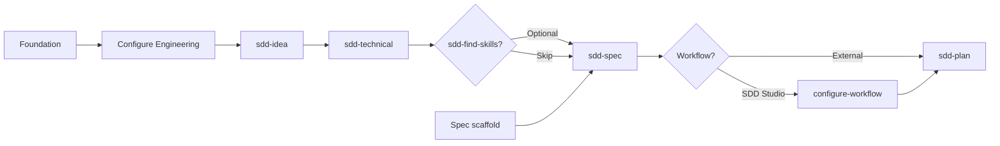

# Greenfield Flow — SDD Studio

Source of truth for the happy path on **greenfield** projects (no existing code).

## Conventions

| Concept | Value |
| -------- | ----- |
| CLI | `npx sdd-studio` or `sdd-studio` |
| Init | `sdd-studio init` |
| Configure Engineering | `sdd-studio configure` or TUI **Configure Engineering** |
| Configure Workflow | `sdd-studio configure-workflow` |
| Skills | Invoke in your chosen assistant (`/sdd-idea`, skill **sdd-idea**, etc.) |

### Canonical skill order

```text
configure → sdd-idea → sdd-technical → [sdd-find-skills] → sdd-spec → [workflow] → sdd-plan
```

**Flexible path:** you may start with **sdd-idea**. Once the product is clear, run **configure**, then **sdd-technical**.

### `.workspace/` map

| Folder | Question |
| ------- | -------- |
| `brief/manifest.yaml` | Which version of each lane is active? |
| `brief/business/<semver>/` | What product do we want? |
| `brief/technical/<semver>/` | How do we decide to build it? |
| `spec/business/` + `spec/technical/` | How is it specified? (living, unversioned) |
| `workflow/` | How do we organize the work? (after spec) |

The initial scaffold creates `manifest.yaml` with `current: "0.1.0"` and folders `brief/business/0.1.0/` and `brief/technical/0.1.0/`.

---

## 1. Terminal startup

When you run `sdd-studio`, the TUI asks:

- **Greenfield** — flow in this document
- **Brownfield** — see `FLOW-BROWNFIELD.md`

### Main menu (Greenfield)

| Option | What it does |
| ------ | -------- |
| **Create brief scaffold** | `manifest.yaml` + versioned stubs + assistant skills. No `spec/`, no `workflow/` |
| **Create spec scaffold** | Empty folders `spec/business/` and `spec/technical/` |
| **Configure Engineering** | Engineering Brief TUI (writes to `brief/technical/<current>/`) |
| **Configure Workflow** | Methodology and task conventions (after spec) |
| **Sync Assistant Files** | Updates packaged skills |
| **Exit** | Closes the TUI |

---

## 2. Foundation — Create brief scaffold

Equivalent to `sdd-studio init` (no spec or workflow).

**Generates:**

- `.workspace/brief/manifest.yaml`
- `.workspace/brief/business/0.1.0/` — stubs `product-principles.md`, `product-guide.md`
- `.workspace/brief/technical/0.1.0/` — engineering stubs (no stack)
- Assistant skills (`.cursor/skills/`, etc.)

**Does not generate:** `spec/`, `workflow/`, `engineering-stack.md`, application code.

**Next step:** **Configure Engineering** or **sdd-idea** (if you prefer to start with product).

---

## 3. Configure Engineering

TUI or `sdd-studio configure`.

**Generated files (6)** in `brief/technical/<current>/`:

- `engineering-principles.md`
- `engineering-decisions.md`
- `engineering-conventions.md`
- `engineering-frontend-patterns.md`
- `engineering-backend-patterns.md`
- `engineering-contribution-patterns.md`

Flow: questions per section → summary → confirmation.

**Next step:** **sdd-idea**

---

## 4. Idea definition — sdd-idea

The user describes the idea in chat and runs **sdd-idea**.

**Phases:** discovery → questions → functional confirmation.

**Generates** in `brief/business/<current>/`:

- `product-principles.md`
- `product-guide.md`

**If you started with idea before configure:** on completion, a friendly message → `sdd-studio configure` → **sdd-technical**.

**Next step:** **sdd-technical** (with Engineering Brief complete).

---

## 5. Spec scaffold — Create spec scaffold

In the TUI, before **sdd-spec**.

**Generates:** empty folders under `.workspace/spec/business/` and `.workspace/spec/technical/` (includes `spec/business/decisions/`).

---

## 6. Technical design — sdd-technical

Reads the Engineering Brief (6 configure files + patterns) from `brief/technical/<current>/`.

Questions per surface (web, mobile, backend, DB, auth, …) → confirmation → writes:

- `brief/technical/<current>/engineering-stack.md`

**Next step (optional):** **sdd-find-skills** — discover and install implementation skills from the open ecosystem based on stack and Brief strategies. Skip if you already use your own skills or agents.

**Next step:** **sdd-spec**

---

## 6b. Implementation skills — sdd-find-skills (optional)

Reads `manifest.yaml` and the confirmed technical Engineering Brief (`engineering-stack.md` + configure decisions and patterns).

**Does not modify** `.workspace/`. Searches skills in the open ecosystem (`npx skills`, https://skills.sh/) — **no fixed catalog** in SDD Studio.

**Flow:**

1. Extracts signals from the **stack** (`**Selected:**` in `engineering-stack.md`) and from **strategies** (decisions and patterns).
2. Searches and validates skills per signal (installs, source, fit).
3. Presents a table with columns `Trigger type` (Stack or Strategy), trigger, suggested skill, installs, source, install command, status.
4. The user may exclude rows; confirms whether to install.
5. Installs with `npx skills add <owner/repo@skill> -g -y` only after explicit approval.

**Next step:** **sdd-spec** or implementation with installed skills.

---

## 7. Specification — sdd-spec

Reads the full brief (product + engineering + stack), including `engineering-*-patterns.md` and **Business Modeling** in `engineering-decisions.md`.

Generates modules under `spec/business/` and `spec/technical/`:

| Business | Technical |
| -------- | --------- |
| domain, relations, capabilities, flows, rules, security, events, **decisions** | api, ui, testing, architecture, database |

Domain modeling lives in spec, not in `engineering-modeling.md`. Domain ADRs go in `spec/business/decisions/<domain>-decisions.md`.

**Next step:** work provider selection.

---

## 8. Workflow — post-spec

The skill or assistant asks which workflow to use:

| Choice | Action |
| -------- | ------ |
| **SDD Studio** | `sdd-studio configure-workflow` → methodology (Kanban, Scrum, …) + conventions → `.workspace/workflow/` |
| **Linear / GitHub Issues / other** | Do not install SDD workflow; **sdd-plan** remains available |

**Next step:** **sdd-plan**

---

## 9. Planning — sdd-plan

Reads brief + spec + task patterns from the technical brief (+ workflow config if applicable).

Proposal → confirmation → generates:

- `workflow/roadmap/`
- `workflow/milestones/`
- `workflow/releases/release-NNN/` (`release.md`, `tasks.md`, `reviews.md`)

**Next step:** implement the first task with your development agent.

---

## 10. Iterative cycle (reference)

| Skill | When |
| ----- | ------ |
| **sdd-review** | Optional; validate changes against Brief or spec |
| **sdd-find-skills** | Optional; after stack confirmed — implementation skills from the open ecosystem |
| **sdd-generate** | Brownfield — see `FLOW-BROWNFIELD.md` |

---

## Diagram



---

## Out of scope (greenfield)

- Brownfield (`sdd-generate`, migrate legacy, refactor engineering) — see `FLOW-BROWNFIELD.md`
- Application code (`src/`, `tests/`)
- `engineering-modeling.md` — removed from the flow; domain lives in **sdd-spec**
