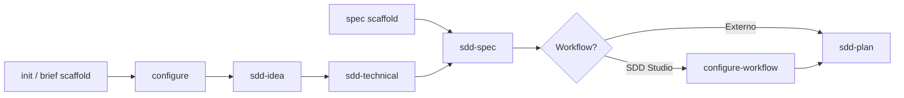
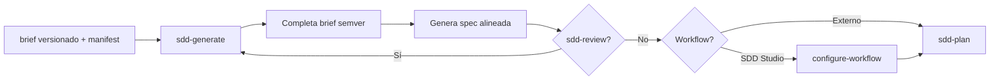

# Skills de SDD Studio

SDD Studio separa dos capas de responsabilidad: la **CLI y la TUI** preparan la estructura del workspace y copian las instrucciones al asistente de IA que uses; la **inteligencia del proceso** vive en las **skills**. Cada skill es un conjunto de reglas, flujos y estándares que el asistente sigue cuando la invocas en el chat. No generan código de aplicación por sí solas: guían la conversación, leen lo que ya existe en `.workspace/` y escriben documentación en el lugar correcto.

El ciclo oficial del método es:

```text
Idea → Brief → Specification → Planning → Implementation → Code
```

Las skills cubren las etapas de Idea, Brief, Specification y Planning. La implementación la haces tú (o tu agente de desarrollo) siguiendo lo que quedó escrito en `.workspace/spec/` y `.workspace/workflow/`.

Hoy existen **seis skills**, idénticas en los tres asistentes empaquetados (Cursor, Claude y Codex). No hay una skill `sdd-studio`: lo que hace el paquete CLI (init, configure, migrate, sync) se ejecuta en la terminal o en la TUI, no como skill de chat.

---

## Cómo invocarlas

Tras `sdd-studio init` (o la opción **Create brief scaffold** en la TUI), las skills se instalan en la ruta nativa de tu asistente:

| Asistente | Ubicación |
| --------- | --------- |
| Cursor (por defecto) | `.cursor/skills/sdd-*/` |
| Claude | `.claude/skills/sdd-*/` |
| Codex | `.agents/skills/sdd-*/` |

En el chat, invócalas de forma explícita:

- Escribe el nombre de la skill: **sdd-idea**, **sdd-spec**, etc.
- O usa el comando slash si tu herramienta lo soporta: `/sdd-idea`, `/sdd-spec`, `/sdd-generate`, `/sdd-technical`, `/sdd-plan`, `/sdd-review`

Todas llevan `disable-model-invocation: true`, lo que significa que no se activan solas: tú decides cuándo arrancar cada una. Eso evita que el asistente escriba spec o planificación sin que lo hayas pedido.

Para actualizar las skills desde el paquete instalado:

```bash
npx sdd-studio sync --skills
```

---

## Skills vs CLI / TUI

No todo el flujo pasa por el chat. Algunos pasos son comandos o menús de la terminal:

| Acción | CLI / TUI | Skill equivalente |
| ------ | --------- | ----------------- |
| Crear estructura base y copiar skills | `sdd-studio init` o TUI **Create brief scaffold** | — |
| Completar Engineering Brief (principios, decisiones, convenciones, patrones) | `sdd-studio configure` o TUI **Configure Engineering** | — (las skills lo referencian pero no lo sustituyen) |
| Crear carpetas vacías de spec | TUI **Create spec scaffold** o `init --spec` | — |
| Configurar metodología de trabajo | `sdd-studio configure-workflow` o TUI **Configure Workflow** | — |
| Migrar workspace legacy a estructura versionada | `sdd-studio migrate` | — |
| Descubrir el producto (greenfield) | — | **sdd-idea** |
| Elegir stack tecnológico | — | **sdd-technical** |
| Generar especificación desde el brief | — | **sdd-spec** |
| Alinear código existente con el workspace | — | **sdd-generate** |
| Revisar y actualizar brief/spec ante cambios | — | **sdd-review** |
| Planificar releases y tareas | — | **sdd-plan** |

La regla práctica: la terminal **prepara el terreno**; las skills **conversan, descubren y documentan**.

---

## sdd-idea — Descubrir el producto

Úsala cuando empiezas un proyecto **greenfield** y aún no tienes claro (o no tienes escrito) el Business Brief. Es la skill de descubrimiento por preguntas: no lee código de aplicación ni inventa dominios técnicos.

**Qué lee:** lo que exista bajo `.workspace/brief/` (solo como contexto; no modifica el brief técnico).

**Qué escribe:** exclusivamente `.workspace/brief/business/`:

- `product-principles.md` — qué es el producto, qué no es, principios inmutables
- `product-guide.md` — recorrido del usuario: entrada, onboarding, bucle principal, caminos alternativos

**Qué no toca:** `.workspace/spec/`, `.workspace/workflow/`, ni ningún archivo bajo `brief/technical/` (esos los crea `sdd-studio configure`).

El flujo es conversacional: bloques de 3–5 preguntas, confirmación, y luego generación. Si empezaste por la idea sin haber pasado por configure, al terminar te orientará a ejecutar `sdd-studio configure` y después **sdd-technical**.

**Siguiente paso típico:** `sdd-studio configure` (si falta el Engineering Brief) → **sdd-technical** → scaffold de spec → **sdd-spec**.

---

## sdd-technical — Definir el stack

Actúa como un desarrollador fullstack en una reunión con el equipo: lee las decisiones de ingeniería ya tomadas y ayuda a **elegir tecnologías concretas** (web, móvil, backend, base de datos, auth, etc.) mediante preguntas de opción múltiple, una a la vez.

**Qué lee:** los seis archivos del Engineering Brief generados por configure:

- `engineering-principles.md`
- `engineering-decisions.md`
- `engineering-conventions.md`
- `engineering-frontend-patterns.md`
- `engineering-backend-patterns.md`
- `engineering-contribution-patterns.md`

Si alguno falta o sigue siendo un stub vacío, **se detiene** y pide completar configure antes de continuar.

**Qué escribe:** un solo archivo nuevo:

- `engineering-stack.md` — solo las tecnologías confirmadas, sin recomendaciones descartadas

**Qué no toca:** los archivos de entrada del brief técnico ni `.workspace/spec/`.

**Siguiente paso típico:** crear el scaffold de spec (TUI o `init --spec`) → **sdd-spec**.

---

## sdd-spec — Especificar dominios

Transforma el brief completo en una especificación estructurada por dominios. El **Product Guide** es la fuente funcional única: todo lo que aparece en spec debe poder rastrearse a ese documento. El brief técnico aporta contexto de arquitectura, patrones y stack.

**Qué lee:** todo `.workspace/brief/` (business + technical, incluyendo `engineering-stack.md` y los archivos `engineering-*-patterns.md`).

**Qué escribe:** bajo `.workspace/spec/`, **12 archivos por dominio**:

- Business: domain, relations, capabilities, flows, rules, security, events
- Technical: api, ui, testing, architecture, database

Primero propone el mapa de dominios y espera tu aprobación; después descubre y genera. Al final ejecuta el validador `validate-spec.mjs` hasta que pase sin errores.

**Qué no toca:** `.workspace/brief/` ni `.workspace/workflow/`.

**Siguiente paso típico:** elegir proveedor de trabajo (SDD Studio → `configure-workflow`; externo → directo a **sdd-plan**) → **sdd-plan**. Opcionalmente **sdd-review** antes de planificar.

---

## sdd-generate — Alinear un codebase existente

Es la skill **brownfield**: explora el código de la aplicación, compara con lo que hay (o no hay) en `.workspace/`, y propone completar o corregir brief y spec. Opera en **modo conservador**: primero analiza y presenta un informe; solo escribe después de tu aprobación explícita.

**Qué lee:** el código en la raíz de producto resuelta desde `engineering-decisions.md`, más todo `.workspace/brief/`, `.workspace/spec/` y el `manifest.yaml` en proyectos versionados.

**Qué escribe:** archivos bajo `.workspace/brief/` (business y technical, incluido `engineering-stack.md` cuando aplique) y los 12 archivos por dominio en `.workspace/spec/`.

**Qué no toca:** código de aplicación (`src/`, etc.) ni `.workspace/workflow/`.

Para greenfield sin código, usa **sdd-idea** + **sdd-spec** en lugar de esta skill.

**Siguiente paso típico:** **sdd-review** (opcional, para validar) → `configure-workflow` si aplica → **sdd-plan**.

---

## sdd-review — Revisar cambios contra el brief y la spec

Úsala cuando algo cambia: una nueva funcionalidad, un ajuste de API, una regla de negocio distinta, o cuando quieres comprobar que brief y spec siguen siendo coherentes entre sí. Analiza el impacto, pregunta si hay ambigüedad, propone los archivos afectados y aplica los cambios tras confirmación.

**Qué lee:** todo `.workspace/brief/` y `.workspace/spec/`.

**Qué escribe:** brief business, brief technical (con límites: principios, decisiones, convenciones y patrones de ingeniería deben actualizarse vía `sdd-studio configure`; cambios de stack vía **sdd-technical**) y archivos de dominio en spec.

**Qué no toca:** `.workspace/workflow/` ni código de aplicación.

Ejecuta `validate-spec.mjs` tras editar spec.

**Siguiente paso típico:** si el cambio es grande en dominios nuevos, puede recomendar **sdd-spec**; si solo validaste, continúa con **sdd-plan** o implementación según el caso.

---

## sdd-plan — Planificar el trabajo

Convierte brief + spec validada en un plan ejecutable bajo `.workspace/workflow/`. Lee las restricciones técnicas, los dominios, las capacidades prioritarias y, si existe, `workflow-config.md` (metodología Kanban, Scrum, convenciones de tareas, etc.).

**Qué lee:** todo `.workspace/brief/`, todo `.workspace/spec/`, y opcionalmente `.workspace/workflow/workflow-config.md`.

**Qué escribe:**

- `workflow/roadmap/roadmap-NNN.md`
- `workflow/milestones/milestone-NNN.md`
- `workflow/releases/release-NNN/` con `release.md`, `tasks.md`, `reviews.md` y `decisions.md`

Deriva tareas (`TASK-001`, …) desde capacidades y flujos de la spec. Valida con `validate-workflow.mjs`.

**Qué no toca:** brief ni spec (si detecta huecos críticos, te manda a **sdd-spec** o **sdd-review**).

**Siguiente paso típico:** implementar la primera tarea de `tasks.md` con tu agente de desarrollo.

---

## Flujo greenfield

Proyecto nuevo, sin código (o sin código relevante que analizar):

```text
configure → sdd-idea → sdd-technical → [spec scaffold] → sdd-spec → [configure-workflow] → sdd-plan
```

Puedes invertir el inicio: **sdd-idea** antes de configure. Cuando el producto esté claro, completas el Engineering Brief con `sdd-studio configure`, sigues con **sdd-technical**, y el resto del camino igual.

En cualquier momento del ciclo, **sdd-review** es opcional para validar coherencia antes de planificar o implementar. **sdd-generate** no forma parte de este flujo.



---

## Flujo brownfield

Proyecto con código existente que quieres documentar o alinear con SDD:

```text
migrate (si legacy) → sdd-generate → [sdd-review] → [configure-workflow] → sdd-plan
```

El brief brownfield usa carpetas **semver** (`0.1.0`, `0.2.0`, …) y un `manifest.yaml` que indica qué versión de cada carril está activa (`current`), en borrador (`target`) o archivada. **sdd-generate** resuelve rutas según ese manifiesto, completa brief y spec, y pide confirmación antes de escribir.

**sdd-idea**, **sdd-technical** y **sdd-spec** siguen siendo válidas en brownfield si prefieres el camino por fases (por ejemplo, redefinir producto con **sdd-idea** en una nueva versión `target`), pero el punto de entrada habitual es **sdd-generate**.



---

## Tabla resumen

| Skill | Cuándo usarla | Lee principalmente | Escribe principalmente | Siguiente paso |
| ----- | ------------- | ------------------ | ---------------------- | -------------- |
| **sdd-idea** | Greenfield; definir producto por conversación | `brief/` (contexto) | `brief/business/` | configure → sdd-technical |
| **sdd-technical** | Engineering Brief completo; elegir stack | `brief/technical/` (6 archivos de configure) | `engineering-stack.md` | spec scaffold → sdd-spec |
| **sdd-spec** | Brief listo; generar especificación por dominios | Todo `brief/` | `spec/business/` + `spec/technical/` | configure-workflow → sdd-plan |
| **sdd-generate** | Brownfield; código existente sin spec o desalineada | Código + `brief/` + `spec/` | `brief/` + `spec/` (con aprobación) | sdd-review → sdd-plan |
| **sdd-review** | Cambios, inconsistencias, validación | `brief/` + `spec/` | `brief/` + `spec/` (acotado) | sdd-plan o implementación |
| **sdd-plan** | Spec validada; organizar trabajo | `brief/` + `spec/` + workflow config | `workflow/` | Implementar `tasks.md` |

---

## Documentación relacionada

- [FLOW-GREENFIELD.md](./FLOW-GREENFIELD.md) — camino feliz greenfield (TUI + skills)
- [FLOW-BROWNFIELD.md](./FLOW-BROWNFIELD.md) — camino feliz brownfield (manifest, semver, sdd-generate)
- [README.md](./README.md) — instalación, asistentes soportados y referencia CLI
