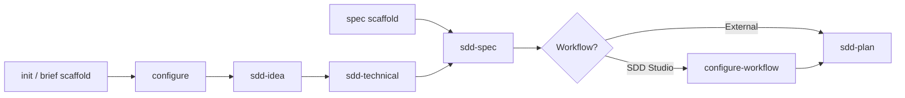
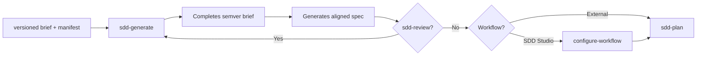

# SDD Studio Skills

SDD Studio separates two layers of responsibility: the **CLI and TUI** prepare the workspace structure and copy instructions to your AI assistant; the **process intelligence** lives in **skills**. Each skill is a set of rules, flows, and standards the assistant follows when you invoke it in chat. They do not generate application code on their own: they guide the conversation, read what already exists in `.workspace/`, and write documentation in the right place.

The official method cycle is:

```text
Idea → Brief → Specification → Planning → Implementation → Code
```

Skills cover Idea, Brief, Specification, and Planning stages. Implementation is yours (or your development agent's), following what was written in `.workspace/spec/` and `.workspace/workflow/`.

There are **seven skills** today, identical across the three packaged assistants (Cursor, Claude, and Codex). There is no `sdd-studio` skill: what the CLI package does (init, configure, migrate, sync) runs in the terminal or TUI, not as a chat skill.

---

## How to invoke them

After `sdd-studio init` (or TUI **Create brief scaffold**), skills install in your assistant's native path:

| Assistant | Location |
| --------- | --------- |
| Cursor (default) | `.cursor/skills/sdd-*/` |
| Claude | `.claude/skills/sdd-*/` |
| Codex | `.agents/skills/sdd-*/` |

In chat, invoke them explicitly:

- Type the skill name: **sdd-idea**, **sdd-spec**, etc.
- Or use the slash command if your tool supports it: `/sdd-idea`, `/sdd-spec`, `/sdd-generate`, `/sdd-technical`, `/sdd-find-skills`, `/sdd-plan`, `/sdd-review`

All have `disable-model-invocation: true`, meaning they do not activate on their own: you decide when to start each one. That prevents the assistant from writing spec or planning without you asking.

To update skills from the installed package:

```bash
npx sdd-studio sync --skills
```

---

## Skills vs CLI / TUI

Not every step goes through chat. Some steps are terminal commands or menus:

| Action | CLI / TUI | Equivalent skill |
| ------ | --------- | ----------------- |
| Create base structure and copy skills | `sdd-studio init` or TUI **Create brief scaffold** | — |
| Complete Engineering Brief (principles, decisions, conventions, patterns) | `sdd-studio configure` or TUI **Configure Engineering** | — (skills reference it but do not replace it) |
| Create empty spec folders | TUI **Create spec scaffold** or `init --spec` | — |
| Configure work methodology | `sdd-studio configure-workflow` or TUI **Configure Workflow** | — |
| Migrate legacy workspace to versioned structure | `sdd-studio migrate` | — |
| Discover the product (greenfield) | — | **sdd-idea** |
| Choose technology stack | — | **sdd-technical** |
| Generate specification from the brief | — | **sdd-spec** |
| Align existing code with the workspace | — | **sdd-generate** |
| Review and update brief/spec after changes | — | **sdd-review** |
| Plan releases and tasks | — | **sdd-plan** |

The practical rule: the terminal **prepares the ground**; skills **converse, discover, and document**.

---

## sdd-idea — Discover the product

Use it when you start a **greenfield** project and do not yet have (or have not written) the Business Brief. It is the discovery skill through questions: it does not read application code or invent technical domains.

**Reads:** whatever exists under `.workspace/brief/` (context only; does not modify the technical brief).

**Writes:** exclusively `.workspace/brief/business/`:

- `product-principles.md` — what the product is, what it is not, immutable principles
- `product-guide.md` — user journey: entry, onboarding, main loop, alternate paths

**Does not touch:** `.workspace/spec/`, `.workspace/workflow/`, or any file under `brief/technical/` (those are created by `sdd-studio configure`).

The flow is conversational: blocks of 3–5 questions, confirmation, then generation. If you started with idea before configure, on completion it guides you to run `sdd-studio configure`, then **sdd-technical**.

**Typical next step:** `sdd-studio configure` (if Engineering Brief is missing) → **sdd-technical** → spec scaffold → **sdd-spec**.

---

## sdd-technical — Define the stack

Acts like a fullstack developer in a team meeting: reads engineering decisions already made and helps **choose concrete technologies** (web, mobile, backend, database, auth, etc.) through multiple-choice questions, one at a time.

**Reads:** the six Engineering Brief files generated by configure:

- `engineering-principles.md`
- `engineering-decisions.md`
- `engineering-conventions.md`
- `engineering-frontend-patterns.md`
- `engineering-backend-patterns.md`
- `engineering-contribution-patterns.md`

If any is missing or still an empty stub, it **stops** and asks to complete configure first.

**Writes:** one new file:

- `engineering-stack.md` — only confirmed technologies, no discarded recommendations

**Does not touch:** technical brief input files or `.workspace/spec/`.

**Typical next step:** optional **sdd-find-skills** (implementation skills from the open ecosystem) → create spec scaffold (TUI or `init --spec`) → **sdd-spec**.

---

## sdd-find-skills — Discover implementation skills (optional)

Reads the confirmed Engineering Brief and `engineering-stack.md`, extracts signals from the **stack** (chosen technologies) and **strategies** (configure decisions and patterns), and searches skills in the open ecosystem (`npx skills`, https://skills.sh/).

**Does not use a fixed catalog in SDD Studio.** Each recommendation derives from the project brief and is validated with quality criteria (installs, source, fit to trigger).

**Reads:** `manifest.yaml` and all files under `brief/technical/<current>/`, especially `engineering-stack.md`.

**Writes:** nothing in `.workspace/`. Optionally installs approved skills with `npx skills add ... -g -y`.

**Presentation:** table with columns `Trigger type` (Stack or Strategy), trigger, suggested skill, installs, source, install command, and status. The user may exclude rows before installing.

**Does not touch:** brief, spec, workflow.

**Typical next step:** **sdd-spec** or continue implementation with installed skills.

**When to skip:** if you already use your own skills or agents.

---

## sdd-spec — Specify domains

Transforms the full brief into a structured specification by domain. The **Product Guide** is the single functional source: everything in spec must trace back to that document. The technical brief provides architecture, patterns, and stack context.

**Reads:** all of `.workspace/brief/` (business + technical, including `engineering-stack.md` and `engineering-*-patterns.md` files).

**Writes:** under `.workspace/spec/`, **12 files per domain**:

- Business: domain, relations, capabilities, flows, rules, security, events
- Technical: api, ui, testing, architecture, database

First proposes the domain map and waits for your approval; then discovers and generates. Finally runs validator `validate-spec.mjs` until it passes without errors.

**Does not touch:** `.workspace/brief/` or `.workspace/workflow/`.

**Typical next step:** choose work provider (SDD Studio → `configure-workflow`; external → straight to **sdd-plan**). Optionally **sdd-review** before planning.

---

## sdd-generate — Align an existing codebase

The **brownfield** skill: explores application code, compares with what exists (or does not) in `.workspace/`, and proposes completing or correcting brief and spec. Operates in **conservative mode**: first analyzes and presents a report; only writes after your explicit approval.

**Reads:** code at the product root resolved from `engineering-decisions.md`, plus all `.workspace/brief/`, `.workspace/spec/`, and `manifest.yaml` in versioned projects.

**Writes:** files under `.workspace/brief/` (business and technical, including `engineering-stack.md` when applicable) and the 12 files per domain in `.workspace/spec/`.

**Does not touch:** application code (`src/`, etc.) or `.workspace/workflow/`.

For greenfield without code, use **sdd-idea** + **sdd-spec** instead of this skill.

**Typical next step:** **sdd-review** (optional, to validate) → `configure-workflow` if applicable → **sdd-plan**.

---

## sdd-review — Review changes against brief and spec

Use it when something changes: a new feature, an API adjustment, a different business rule, or when you want to check that brief and spec remain coherent. Analyzes impact, asks when ambiguous, proposes affected files, and applies changes after confirmation.

**Reads:** all `.workspace/brief/` and `.workspace/spec/`.

**Writes:** business brief, technical brief (with limits: principles, decisions, conventions, and engineering patterns must be updated via `sdd-studio configure`; stack changes via **sdd-technical**) and domain files in spec.

**Does not touch:** `.workspace/workflow/` or application code.

Runs `validate-spec.mjs` after editing spec.

**Typical next step:** if the change is large with new domains, it may recommend **sdd-spec**; if you only validated, continue with **sdd-plan** or implementation as appropriate.

---

## sdd-plan — Plan the work

Converts brief + validated spec into an executable plan under `.workspace/workflow/`. Reads technical constraints, domains, priority capabilities, and, if present, `workflow-config.md` (Kanban, Scrum methodology, task conventions, etc.).

**Reads:** all `.workspace/brief/`, all `.workspace/spec/`, and optionally `.workspace/workflow/workflow-config.md`.

**Writes:**

- `workflow/roadmap/roadmap-NNN.md`
- `workflow/milestones/milestone-NNN.md`
- `workflow/releases/release-NNN/` with `release.md`, `tasks.md`, `reviews.md`, and `decisions.md`

Derives tasks (`TASK-001`, …) from capabilities and flows in spec. Validates with `validate-workflow.mjs`.

**Does not touch:** brief or spec (if it detects critical gaps, it sends you to **sdd-spec** or **sdd-review**).

**Typical next step:** implement the first task in `tasks.md` with your development agent.

---

## Greenfield flow

New project, no code (or no relevant code to analyze):

```text
configure → sdd-idea → sdd-technical → [sdd-find-skills] → [spec scaffold] → sdd-spec → [configure-workflow] → sdd-plan
```

You may invert the start: **sdd-idea** before configure. Once the product is clear, complete the Engineering Brief with `sdd-studio configure`, continue with **sdd-technical**, and the rest of the path is the same.

At any point in the cycle, **sdd-review** is optional to validate coherence before planning or implementing. **sdd-generate** is not part of this flow.



---

## Brownfield flow

Project with existing code you want to document or align with SDD:

```text
migrate (if legacy) → sdd-generate → [sdd-review] → [configure-workflow] → sdd-plan
```

The brownfield brief uses **semver** folders (`0.1.0`, `0.2.0`, …) and a `manifest.yaml` indicating which version of each lane is active (`current`), in draft (`target`), or archived. **sdd-generate** resolves paths from that manifest, completes brief and spec, and asks for confirmation before writing.

**sdd-idea**, **sdd-technical**, and **sdd-spec** remain valid in brownfield if you prefer the phased path (e.g. redefine product with **sdd-idea** in a new `target` version), but the usual entry point is **sdd-generate**.



---

## Summary table

| Skill | When to use | Reads mainly | Writes mainly | Next step |
| ----- | ------------- | ------------------ | ---------------------- | -------------- |
| **sdd-idea** | Greenfield; define product through conversation | `brief/` (context) | `brief/business/` | configure → sdd-technical |
| **sdd-technical** | Engineering Brief complete; choose stack | `brief/technical/` (6 configure files) | `engineering-stack.md` | sdd-find-skills (opt.) → spec scaffold → sdd-spec |
| **sdd-find-skills** | Stack confirmed; search implementation skills | `brief/technical/` + `engineering-stack.md` | — (installs external skills with approval) | sdd-spec or implementation |
| **sdd-spec** | Brief ready; generate specification by domain | All `brief/` | `spec/business/` + `spec/technical/` | configure-workflow → sdd-plan |
| **sdd-generate** | Brownfield; existing code without spec or misaligned | Code + `brief/` + `spec/` | `brief/` + `spec/` (with approval) | sdd-review → sdd-plan |
| **sdd-review** | Changes, inconsistencies, validation | `brief/` + `spec/` | `brief/` + `spec/` (scoped) | sdd-plan or implementation |
| **sdd-plan** | Validated spec; organize work | `brief/` + `spec/` + workflow config | `workflow/` | Implement `tasks.md` |

---

## Related documentation

- [FLOW-GREENFIELD.md](./FLOW-GREENFIELD.md) — greenfield happy path (TUI + skills)
- [FLOW-BROWNFIELD.md](./FLOW-BROWNFIELD.md) — brownfield happy path (manifest, semver, sdd-generate)
- [README.md](../README.md) — installation, supported assistants, and CLI reference
