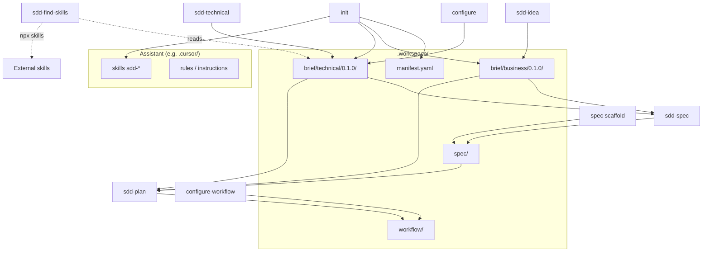

# SDD Studio Workspace Architecture

Visual reference for **all files and folders** a project can have when SDD Studio is fully configured: greenfield from `init` through spec, workflow, and planning.

This document describes the **knowledge structure** of the SDD method. It does not include application code (`src/`, `app/`, etc.) — that lives outside `.workspace/`.

---

## Legend

| Symbol / label | Meaning |
| --- | --- |
| `[foundation]` | `sdd-studio init` or TUI *Create brief scaffold* |
| `[configure]` | `sdd-studio configure` |
| `[sdd-idea]` | Skill **sdd-idea** |
| `[sdd-technical]` | Skill **sdd-technical** |
| `[sdd-find-skills]` | Skill **sdd-find-skills** *(optional; does not write to `.workspace/`)* |
| `[spec scaffold]` | TUI *Create spec scaffold* or `init --spec` |
| `[sdd-spec]` | Skill **sdd-spec** |
| `[configure-workflow]` | `sdd-studio configure-workflow` |
| `[sdd-plan]` | Skill **sdd-plan** |
| `[sync]` | `sdd-studio sync` (updates packaged skills) |
| `(stub)` | Minimal template; replaced or completed in a later step |
| `(optional)` | Not required in all projects |

---

## Canonical order (full greenfield)

```text
init → configure → sdd-idea → sdd-technical → [sdd-find-skills] → spec scaffold → sdd-spec → configure-workflow → sdd-plan
```

See [FLOW-GREENFIELD.md](./FLOW-GREENFIELD.md) for detail on each step.

---

## Overview

```text
./
├── .workspace/                    # Product knowledge (SDD)
│   ├── brief/                     # Context and decisions
│   ├── spec/                      # Formal specification by domain
│   └── workflow/                  # Planning (releases, tasks)
│
└── <assistant>/                   # Skills and instructions (per --assistant)
    ├── Cursor    → .cursor/
    ├── Claude    → CLAUDE.md + .claude/
    ├── Codex     → AGENTS.md + .agents/
    ├── OpenCode  → .opencode/
    └── Copilot   → .github/
```

---

## `.workspace/` — complete tree

Reference state: **brief `0.1.0`**, one spec domain `task`, first release planned, **Cursor** assistant.

```text
.workspace/
│
├── brief/
│   │
│   ├── manifest.yaml                          # [foundation] Business/technical versions + spec alignment
│   │
│   ├── business/
│   │   └── 0.1.0/                             # Active semver folder (business.current)
│   │       ├── product-principles.md          # [foundation] stub → [sdd-idea]
│   │       └── product-guide.md               # [foundation] stub → [sdd-idea]
│   │
│   └── technical/
│       └── 0.1.0/                             # Active semver folder (technical.current)
│           ├── engineering-principles.md      # [foundation] stub → [configure]
│           ├── engineering-decisions.md       # [foundation] stub → [configure]
│           ├── engineering-conventions.md     # [foundation] stub → [configure]
│           ├── engineering-frontend-patterns.md    # [foundation] stub → [configure]
│           ├── engineering-backend-patterns.md     # [foundation] stub → [configure]
│           ├── engineering-contribution-patterns.md # [foundation] stub → [configure]
│           └── engineering-stack.md           # [sdd-technical] (does not exist after foundation)
│
├── spec/                                      # Unversioned — lives aligned to brief via manifest
│   │
│   ├── business/
│   │   ├── domain/
│   │   │   ├── .gitkeep                       # [spec scaffold]
│   │   │   └── task-domain.md                 # [sdd-spec]
│   │   ├── relations/
│   │   │   ├── .gitkeep
│   │   │   └── task-relations.md              # [sdd-spec]
│   │   ├── capabilities/
│   │   │   ├── .gitkeep
│   │   │   └── task-capabilities.md           # [sdd-spec]
│   │   ├── flows/
│   │   │   ├── .gitkeep
│   │   │   └── task-flows.md                  # [sdd-spec]
│   │   ├── rules/
│   │   │   ├── .gitkeep
│   │   │   └── task-rules.md                  # [sdd-spec]
│   │   ├── security/
│   │   │   ├── .gitkeep
│   │   │   └── task-security.md               # [sdd-spec]
│   │   ├── events/
│   │   │   ├── .gitkeep
│   │   │   └── task-events.md                 # [sdd-spec]
│   │   └── decisions/
│   │       ├── .gitkeep
│   │       └── task-decisions.md              # [sdd-spec] domain ADRs
│   │
│   └── technical/
│       ├── api/
│       │   ├── .gitkeep
│       │   └── task-api.md                    # [sdd-spec]
│       ├── ui/
│       │   ├── .gitkeep
│       │   └── task-ui.md                     # [sdd-spec]
│       ├── testing/
│       │   ├── .gitkeep
│       │   └── task-testing.md                # [sdd-spec]
│       ├── architecture/
│       │   ├── .gitkeep
│       │   └── task-architecture.md           # [sdd-spec]
│       └── database/
│           ├── .gitkeep
│           └── task-database.md               # [sdd-spec]
│
└── workflow/
    ├── workflow-config.md                     # [workflow scaffold] stub → [configure-workflow]
    ├── roadmap/
    │   ├── .gitkeep                           # [workflow scaffold]
    │   └── roadmap-001.md                     # [sdd-plan]
    ├── milestones/
    │   ├── .gitkeep                           # [workflow scaffold]
    │   └── milestone-001.md                   # [sdd-plan]
    └── releases/
        └── release-001/
            ├── release.md                     # [workflow scaffold] stub → [sdd-plan]
            ├── tasks.md                       # [workflow scaffold] stub → [sdd-plan]
            └── reviews.md                     # [workflow scaffold] stub → [sdd-plan]
```

### Multiple domains in `spec/`

Each new domain adds **13 files** (same `<domain>-<category>.md` convention). Example with domains `task` and `user`:

```text
spec/business/domain/
├── task-domain.md
└── user-domain.md
spec/technical/api/
├── task-api.md
└── user-api.md
# … (11 categories × N domains)
```

No per-domain subfolders are created inside `spec/`.

---

## `manifest.yaml`

Central brief versioning file. Skills resolve paths by reading `business.current` and `technical.current`.

```yaml
schema: 1

business:
  current: "0.1.0"      # brief/business/<current>/
  target: null          # refactor draft (brownfield)
  archived: []            # previous versions

technical:
  current: "0.1.0"
  target: null
  archived: []

spec:
  aligned_with:
    business: "0.1.0"     # spec generated against this business brief version
    technical: "0.1.0"
```

| Field | Use |
| --- | --- |
| `current` | Active version skills read |
| `target` | Draft without breaking what is live |
| `archived` | History |
| `spec.aligned_with` | Spec ↔ brief traceability |

---

## Brief — files and owners

### Business (`brief/business/<semver>/`)

| File | Question it answers | Generated by |
| --- | --- | --- |
| `product-principles.md` | What conceptual principles is the product built on? | **sdd-idea** |
| `product-guide.md` | How does the product work for a user? | **sdd-idea** |

### Technical (`brief/technical/<semver>/`)

| File | Question it answers | Generated by |
| --- | --- | --- |
| `engineering-principles.md` | What kind of system is it? (no concrete stack) | **configure** |
| `engineering-decisions.md` | How is it structured? (repos, DDD, auth, testing…) | **configure** |
| `engineering-conventions.md` | How does the team write? | **configure** |
| `engineering-frontend-patterns.md` | What FE patterns apply to every feature? | **configure** |
| `engineering-backend-patterns.md` | What BE patterns apply to every API? | **configure** |
| `engineering-contribution-patterns.md` | How do we contribute (branches, PRs)? | **configure** |
| `engineering-stack.md` | What concrete technologies do we use? | **sdd-technical** |

**Not generated in greenfield:** `engineering-modeling.md` (legacy / brownfield migrate only).

---

## Spec — 13 files per domain

Convention: `spec/<business|technical>/<category>/<domain>-<category>.md`

| # | Path (domain `task`) | Question |
| --- | --- | --- |
| 1 | `business/domain/task-domain.md` | What is the domain? |
| 2 | `business/relations/task-relations.md` | What does it relate to? |
| 3 | `business/capabilities/task-capabilities.md` | What can the system do? |
| 4 | `business/flows/task-flows.md` | How do processes happen? |
| 5 | `business/rules/task-rules.md` | What business rules apply? |
| 6 | `business/security/task-security.md` | Who can do what? |
| 7 | `business/events/task-events.md` | What events does it produce? |
| 8 | `business/decisions/task-decisions.md` | ADRs and domain decisions |
| 9 | `technical/api/task-api.md` | API contract |
| 10 | `technical/ui/task-ui.md` | Interface behavior |
| 11 | `technical/testing/task-testing.md` | Verification scenarios |
| 12 | `technical/architecture/task-architecture.md` | Modules and layers |
| 13 | `technical/database/task-database.md` | Persistence |

Files `*-api.md` and `*-ui.md` must align with `engineering-*-patterns.md` in the technical brief.

---

## Workflow — planning

| Path | Content | Generated by |
| --- | --- | --- |
| `workflow-config.md` | Methodology (Kanban/Scrum) and task conventions | **configure-workflow** |
| `roadmap/roadmap-NNN.md` | `ROADMAP-NNN`, goal, scope, releases | **sdd-plan** |
| `milestones/milestone-NNN.md` | `MILESTONE-NNN`, criteria (MVP, Beta…) | **sdd-plan** |
| `releases/release-NNN/release.md` | `RELEASE-NNN`, version, status, milestone | **sdd-plan** |
| `releases/release-NNN/tasks.md` | `TASK-NNN` table (one file per release) | **sdd-plan** |
| `releases/release-NNN/reviews.md` | `REVIEW-NNN` table | **sdd-plan** |

Each `release-NNN/` folder contains **exactly** those three files — no `decisions.md` or extras.

---

## Assistant files (Cursor — default)

Installed with `sdd-studio init --assistant cursor` and updatable with `sdd-studio sync`.

```text
.cursor/
├── rules/
│   └── sdd-studio.mdc                           # [foundation] Always-on SDD cycle rules
│
└── skills/
    ├── sdd-idea/
    │   ├── SKILL.md
    │   ├── STANDARDS.md
    │   └── EXAMPLES.md
    ├── sdd-technical/
    │   ├── SKILL.md
    │   ├── STANDARDS.md
    │   └── EXAMPLES.md
    ├── sdd-find-skills/                         # (optional in the flow)
    │   ├── SKILL.md
    │   ├── STANDARDS.md
    │   └── EXAMPLES.md
    ├── sdd-generate/                            # Brownfield
    │   ├── SKILL.md
    │   ├── STANDARDS.md
    │   └── EXAMPLES.md
    ├── sdd-spec/
    │   ├── SKILL.md
    │   ├── STANDARDS.md
    │   ├── EXAMPLES.md
    │   └── scripts/
    │       └── validate-spec.mjs
    ├── sdd-review/
    │   ├── SKILL.md
    │   ├── STANDARDS.md
    │   ├── EXAMPLES.md
    │   └── scripts/
    │       └── validate-spec.mjs
    └── sdd-plan/
        ├── SKILL.md
        ├── STANDARDS.md
        ├── EXAMPLES.md
        └── scripts/
            └── validate-workflow.mjs
```

### Other assistants (same logic, different layout)

| Assistant | Instructions | Skills (7) |
| --- | --- | --- |
| **Claude** | `CLAUDE.md` | `.claude/skills/sdd-*/` |
| **Codex** | `AGENTS.md` | `.agents/skills/sdd-*/` + `agents/openai.yaml` per skill |
| **OpenCode** | — | `.opencode/commands/sdd-*.md` + `.opencode/sdd-studio/sdd-*/` |
| **Copilot** | `.github/copilot-instructions.md` | `.github/agents/*.agent.md` + `.github/prompts/*.prompt.md` + `.github/sdd-studio/sdd-*/` |

Packaged skills: `sdd-idea`, `sdd-technical`, `sdd-find-skills`, `sdd-generate`, `sdd-spec`, `sdd-review`, `sdd-plan`.

---

## What each CLI command generates

| Command / TUI action | Creates in the project |
| --- | --- |
| `sdd-studio init` | `.workspace/brief/` (manifest + `0.1.0` stubs) + assistant skills |
| `sdd-studio init --spec` | Above + `spec/` folders with `.gitkeep` |
| `sdd-studio init --workflow` | Above + `workflow/` scaffold |
| `sdd-studio configure` | Completes 6 files in `brief/technical/<current>/` |
| `sdd-studio configure-workflow` | Workflow scaffold (if missing) + `workflow-config.md` |
| TUI *Create spec scaffold* | `spec/` folders |
| `sdd-studio sync` | Updates assistant skills/rules (does not touch `.workspace/`) |
| `sdd-studio migrate` | Migrates legacy brief to versioned layout (brownfield) |

Conversational skills (**sdd-idea**, **sdd-technical**, **sdd-spec**, **sdd-plan**, etc.) write to `.workspace/` per their scope; they are not CLI commands.

---

## Optional paths and out of scope

| Element | Behavior |
| --- | --- |
| **sdd-find-skills** | Reads technical brief; searches skills.sh; may install skills with `npx skills add`. **Does not write** to `.workspace/`. |
| **sdd-review** | Validates or aligns brief/spec; does not create mandatory new structure. |
| **sdd-generate** | Brownfield — aligns existing code with brief/spec. |
| **External workflow** (Linear, GitHub Issues) | SDD `workflow/` may be omitted. |
| **`init` without `--spec`** | No `spec/` folder until scaffold. |
| **`init` without `--workflow`** | No `workflow/` until configure-workflow or `init --workflow`. |
| **Application code** | `src/`, `app/`, `packages/`, app tests — team responsibility, not SDD Studio. |
| **Installed external skills** | Live in the assistant environment (`npx skills`), not under `.workspace/`. |
| **Archived versions** | `brief/business/0.0.1/`, `brief/technical/0.2.0/` (target), etc. — per brownfield evolution. |

---

## Count summary (reference)

Full greenfield project with **1 domain** (`task`) and **Cursor** assistant:

| Group | Approx. files |
| --- | --- |
| Brief | 1 manifest + 2 business + 7 technical = **10** |
| Spec (scaffold) | **13** `.gitkeep` |
| Spec (domain `task`) | **13** `.md` |
| Workflow | 1 config + 2 roadmap/milestone + 3 release = **6** (+ 2 `.gitkeep`) |
| Cursor (skills + rule) | **~26** files |

Each additional spec domain: **+13** files. Each additional release: **+3** files in `releases/release-NNN/`.

---

## Dependency diagram



---

## Related documentation

| Document | Content |
| --- | --- |
| [FLOW-GREENFIELD.md](./FLOW-GREENFIELD.md) | Greenfield flow step by step |
| [FLOW-BROWNFIELD.md](./FLOW-BROWNFIELD.md) | Projects with existing code |
| [SKILLS.md](./SKILLS.md) | Catalog and scope of each skill |
| [PRESENTATION.md](./PRESENTATION.md) | Guide for presenting the solution |
| [README.md](../README.md) | Installation and CLI reference |
